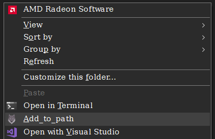

# Add a directory to the PATH
This is a simple batch file to add a directory to the path environment variable. This is useful when you want to add a directory to the path temporarily [.ps1] and permanently [.bat]. For example, when you want to use a program in a directory that is not in the path, you can use this batch file to add the directory to the path temporarily.
### how to use
1. go to the directory that you want to add to the path.
2. right click on any empty space and select `add_to_path`. 
3. a command prompt will open and ask you if you want to add the directory to the path permanently, confirm and you are all set.
#### to use it temporarily use the powershell script
### how to setup
1. clone the repository to a directory `d` in your computer.
2. open the registry editor by typing `regedit` in the run window (win+R).
3. navigate to `HKEY_CLASSES_ROOT\Directory\shell` and create a new key with the name `Add2Path`.
4. create a new key under `Add2Path` and name it `command`.
5. double click on the default value of `command` and set the value to `"d\windows\add2path\add_to_path.bat" "%V"`.
6. You can add the icon by clicking on the `Add2Path` again, add a new string value and name it `Icon` and set the value to `d\windows\add2path\icons8-wolf-32.ico`. 
7. now you can use the batch file by right clicking on any empty space in the directory that you want to add to the path and select `Add2Path`.

### Bugs you may incounter and how to fix them
1. Windows from the begining limited the length of the path variable to 1024 characters for the whole path variable and 256 characters limit for each path. If you have a long path variable, you may not be able to add the directory to the path. To fix this, you can delete some of the directories in the path variable or you can use the powershell script to add the directory to the path temporarily `OR` you can use the shortener.ps1 to shorten the path variable and then add the directory to the path. to know how the shortener works, please refer to the [link](<https://superuser.com/a/1767798>). 
